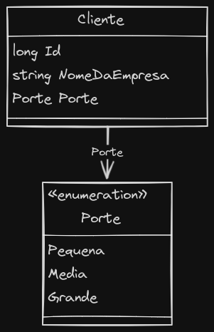

Este projeto é um **sistema de cadastro da empresa dos clientes**. Ele utiliza uma abordagem de Clean Architecture, Domain-Driven Design (DDD), e o padrão CQRS com MediatR.

## Sobre o Projeto

O objetivo deste sistema é fornecer uma interface para gerenciar clientes, categorizando-os pelo porte da empresa e armazenando informações essenciais. O frontend foi desenvolvido em Angular, enquanto o backend foi construído em C# com .NET.

#### Técnicas utilizadas para a construção do projeto:

- Clean Architecture
- CQRS Pattern with MediatR
- SOLID Principles

## Build With

![badge-ubuntu]
![badge-vs-code]
![badge-c-sharp]
![badge-dot-net]
![badge-angular]
![badge-sqlserver]
![badge-swagger]
![badge-postman]

## Diagrama

## Features

### Cliente:

- [x] Cadastro de cliente
- [x] Atualização de dados do cliente
- [x] Listagem de clientes
- [x] Exclusão de cliente

## Como Executar

1. Clone o repositório.
2. Configure o banco de dados SQLServer.
3. Atualize as configurações do banco de dados no arquivo `appsettings.json`.
4. Execute as migrações do Entity Framework.
5. Inicie a aplicação backend em .NET.
6. Navegue até o diretório `frontend` e execute `npm install`.
7. Inicie a aplicação frontend com `ng serve`.

## Autores

[Marcelo](https://github.com/Mmarcelinho) é responsável pela criação e manutenção destes projetos.

## Licença

Este projeto não possui uma licença específica e é fornecido apenas para fins de aprendizado e demonstração.

[badge-ubuntu]: https://img.shields.io/badge/Ubuntu-E95420?style=for-the-badge&logo=ubuntu&logoColor=white
[badge-vs-code]: https://img.shields.io/badge/Visual%20Studio%20Code-0078d7.svg?style=for-the-badge&logo=visual-studio-code&logoColor=white
[badge-c-sharp]: https://img.shields.io/badge/c%23-%23239120.svg?style=for-the-badge&logo=csharp&logoColor=white
[badge-dot-net]: https://img.shields.io/badge/.NET-512BD4?logo=dotnet&logoColor=fff&style=for-the-badge
[badge-angular]: https://img.shields.io/badge/Angular-DD0031?style=for-the-badge&logo=angular&logoColor=white
[badge-sqlserver]: https://img.shields.io/badge/Microsoft%20SQL%20Server-CC2927?logo=microsoftsqlserver&logoColor=fff&style=for-the-badge
[badge-swagger]: https://img.shields.io/badge/Swagger-85EA2D?logo=swagger&logoColor=000&style=for-the-badge
[badge-postman]: https://img.shields.io/badge/Postman-FF6C37?style=for-the-badge&logo=postman&logoColor=white
